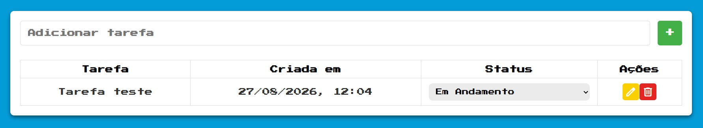

[README.md](https://github.com/user-attachments/files/31556742/README.md)
# ✅ Lista de Tarefas Full Stack



Aplicação pessoal de lista de tarefas criada para praticar o desenvolvimento de uma aplicação full stack. O usuário pode adicionar tarefas, visualizar a data de criação, alterar título e status, e remover itens.

## 🚀 Funcionalidades

- ➕ Cadastro de novas tarefas
- 📋 Listagem das tarefas salvas
- ✏️ Edição do título e do status
- 🗑️ Exclusão de tarefas
- 🕒 Formatação da data para o padrão brasileiro
- 🛡️ Validação dos campos obrigatórios na API

## 🧰 Tecnologias utilizadas

### ⚙️ Backend

- 🟢 Node.js
- 🚂 Express 5
- 📜 JavaScript (CommonJS)
- 🔗 CORS
- 🔐 Dotenv para variáveis de ambiente
- 🔄 Nodemon para desenvolvimento
- 🧹 ESLint para padronização do código

### 🎨 Frontend

- 🧱 HTML5
- 🎨 CSS3
- 📜 JavaScript puro (Vanilla JavaScript)
- 🔄 Fetch API para comunicação com o backend
- 🔣 Google Material Symbols para os ícones de edição e exclusão
- 👾 Fonte Press Start 2P, utilizada na identidade visual da aplicação

### 🗄️ Database

- 🐬 MySQL
- 🔌 MySQL2 para a conexão entre o Node.js e o banco de dados

## 🗂️ Estrutura do projeto

```text
.
├── backend/
│   ├── package.json
│   └── src/
│       ├── app.js
│       ├── router.js
│       ├── server.js
│       ├── controllers/
│       ├── middlewares/
│       └── models/
└── frontend/
    ├── index.html
    ├── css/style.css
    └── js/script.js
```

O backend segue uma separação simples entre rotas, middlewares, controllers e models. O frontend é uma página estática que consome a API REST disponibilizada pelo servidor.

## 📦 Pré-requisitos

- ✅ Node.js instalado
- 🐬 MySQL instalado e em execução
- 🌐 Um navegador web

## 🛠️ Configuração do banco de dados

Crie o banco e a tabela `tasks` no MySQL:

```sql
CREATE DATABASE todolist;

USE todolist;

CREATE TABLE tasks (
    id INT AUTO_INCREMENT PRIMARY KEY,
    title VARCHAR(255) NOT NULL,
    status VARCHAR(50) NOT NULL DEFAULT 'pendente',
    created_at DATETIME NOT NULL
);
```

Na pasta `backend`, crie um arquivo `.env` com as credenciais do seu ambiente:

```env
PORT=3333
MYSQL_HOST=localhost
MYSQL_USER=seu_usuario
MYSQL_PASSWORD=sua_senha
MYSQL_DATABASE=todolist
```

## ▶️ Como executar

1. 📥 Instale as dependências do backend:

```bash
cd backend
npm install
```

2. 🚀 Inicie o servidor em modo de desenvolvimento:

```bash
npm run dev
```

O backend ficará disponível em `http://localhost:3333`.

3. 🌐 Abra `frontend/index.html` no navegador ou utilize uma extensão como o Live Server do VS Code.

Também é possível iniciar o backend em modo normal:

```bash
npm start
```

## 🔌 API

| Método | Rota | Descrição | Corpo |
| --- | --- | --- | --- |
| `GET` | `/tasks` | Lista todas as tarefas | Nenhum |
| `POST` | `/tasks` | Cria uma tarefa | `{ "title": "Estudar Node.js" }` |
| `PUT` | `/tasks/:id` | Atualiza título e status | `{ "title": "Estudar Node.js", "status": "em andamento" }` |
| `DELETE` | `/tasks/:id` | Remove uma tarefa | Nenhum |

📌 Os status utilizados pela aplicação são:

- ⏳ `pendente`
- 🔄 `em andamento`
- ✅ `concluida`

## 💡 Inspiração

Este projeto foi inspirado nos conteúdos e na abordagem prática do **Manual do DEV**, com a proposta de transformar os conceitos estudados em uma aplicação completa. A construção da lista de tarefas serviu como exercício para integrar frontend, API, validações e persistência de dados em um banco MySQL.
